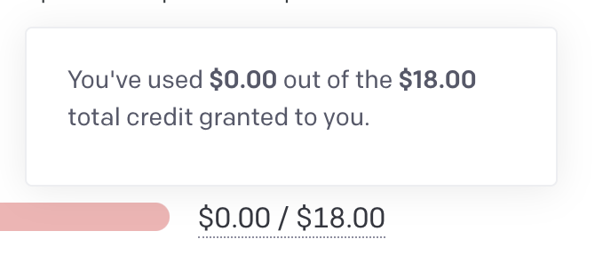

# ❓ Frequently Asked Questions
### Introduction
Below is a list of the most frequently asked questions about AgentGPT. If you have any unanswered questions, please reach out to the moderation or dev team on [Discord](https://discord.gg/jdSBAnmdnY) or [GitHub](https://github.com/reworkd/AgentGPT).

### API key issues

Where can I get an API key?

You should first sign up for an OpenAI account. You can do so <a href="https://openai.com/blog/openai-api">here</a>.
For new accounts, you will be placed under a free tier with $18 of free credits.
All you need to do now is visit the <a href="https://platform.openai.com/account/api-keys">API keys page</a>, create a new key, and place the key within the AgentGPT settings menu.
  
  
<strong>NOTE:</strong> This key should be private and should not be shared publicly. AgentGPT does not save this key in a database, it is simply stored in your browser.

I have free API credits, why is my API key not working?

OpenAI API accounts start with $18 of free tier credits.
Look at your <a href="https://platform.openai.com/account/usage">OpenAI API usage page</a> to see if it has been used up or expired.
Expired credit will show up as red such as the below image

If you have used up your free tier credits, you will need to add billing information into your API key: <a href="https://platform.openai.com/account/billing/overview">OpenAI API Overview</a>.
Note that a few runs of AgentGPT will only cost a few cents.

I have ChatGPT Plus, why is my API key not working?

ChatGPT Plus is independent of your OpenAI API key.
Although you have ChatGPT Plus, it doesn't mean that you will be able to use the API.
All accounts start with $18 of free credits but this can be used of or expired. Given this, you will need to add your billing information into your API key account.
You can do so by visiting the following link and adding a payment method: <a href="https://platform.openai.com/account/billing/overview">OpenAI API Overview</a>.

How much will AgentGPT cost me?

Using AgentGPT is free as we handle the API costs. If you provide your own API key however, the cost per agent deployment will depend on the model that you use.
<ul>
    <li>gpt-3.5-turbo will cost only a few cents per run at most</li>
    <li>gpt-4 is a lot more expensive. Be sure to limit its loops and watch over costs carefully</li>
    <li>NOTE: You can limit the number of loops and number of tokens within the advanced settings</li>
</ul>

### Agent issues

AgentGPT said it made a file / database / script, where can I find it?

Currently AgentGPT is incapable of outputs in that manner, but this is something we are actively working on.
Keep an eye on our <a href="/roadmap">roadmap</a> to get an idea for when this might be available.

Did AgentGPT actually email 100 people?

No! We don't currently support this functionality, but its something we're looking to implement. View our <a href="/roadmap">roadmap</a> to get an idea for when this might be available.
When this does work, we'll be sure to validate that an action like "sending an email" is actually something you want to do 🙂

My agent keeps running out of loops!

We must limit how much the Agent runs in some capacity due to API and infrastructure costs 😢.
If you provide your own API key you can increase the number of loops your Agent goes through within the advanced settings of the settings menu.

My Agent was doing great but then it got stopped! Can I start from where I left off?

Currently all Agent runs are isolated from each other so this is not possible.
This is something we want to add in the future, but in the meantime you can create another AgentGPT run using the information it generated for you from the previous run.
Keep an eye on our <a href="/roadmap">roadmap</a> to get an idea for when this might be available.

Can AgentGPT use GPT-4?

AgentGPT currently uses GPT-3.5 due to costs and availability. If you have API access to GPT-4, you can input your own API key in the settings menu and select GPT-4 as the model.

I have ChatGPT Plus, why can't I use GPT-4?

ChatGPT Plus is independent of your OpenAI API account having access to GPT-4. Unfortunately, our API key account will have to be accepted through the waitlist. Enroll your account here: <a href="https://openai.com/waitlist/gpt-4-api">GPT-4 API waitlist</a>

Why does the output keep getting cut off?

The longer the output is, the more expensive it is on our end to generate it.
Because of this, we have a limit on the output length which can cause longer messages to be cut off.
If you provide your own API key, you can increase the output length within the advanced settings of the settings menu by increasing the number of tokens.

### Misc

What is the difference between this and ChatGPT?

ChatGPT is a great tool that will allow you to ask a specific question and receive a result. It also follows a conversation, so after you have received a response, you can continue talking to it and it will remember (within limits) what was descussed previously.

AgentGPT on the otherhand is a platform for AI agents. You configure an agent to accomplish a broad goal, and it will automatically think and perform tasks to achieve it.

What is the difference between this and AutoGPT?

Both AgentGPT and AutoGPT are projects involving autonomous AI agents. AutoGPT is a tool that one runs locally while AgentGPT is a web based platform.

What can AgentGPT do?

AgentGPT can do a lot, but we're also working on giving it a lot more capabilities. Visit our <a href="/usecases">usecases</a> page to learn about how people currently use AgentGPT.

Does AgentGPT have access to the internet?

Not yet but this is coming very soon! Keep an eye on our <a href="/roadmap">roadmap</a>.

### Local contribution issues

I'm having trouble setting up AgentGPT locally!

Please visit our <a href="/setup">setup</a> guide to diagnose any issues. If you have a problem that is undocumented, please submit an <a href="https://github.com/reworkd/AgentGPT/issues">issue on GitHub</a>.

